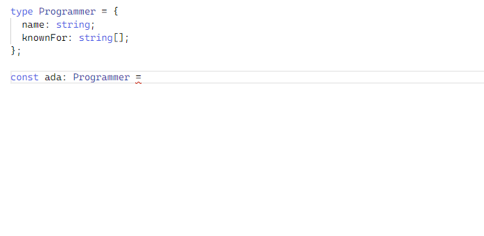
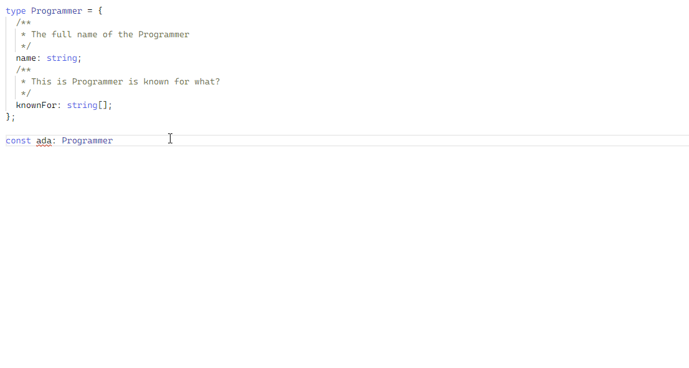
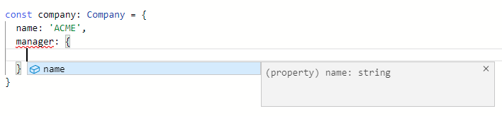

# Cómo Crear Tipos Personalizados en TypeScript 

## Introducción

[TypeScript](https://www.typescriptlang.org/) es una extensión del lenguaje [JavaScript](https://www.digitalocean.com/community/tutorial_series/how-to-code-in-javascript) que utiliza el tiempo de ejecución de JavaScript con un verificador de tipos en tiempo de compilación. Esta combinación permite a los desarrolladores usar el ecosistema completo de JavaScript y las características del lenguaje, al mismo tiempo que agregan verificación de tipo estático, enumeraciones, clases e interfaces opcionales.

Aunque los prefabricados [tipos básicos en TypeScript](https://www.digitalocean.com/community/tutorials/how-to-use-basic-types-in-typescript) cubrirán muchos casos de uso, la creación de sus propios tipos personalizados basados en estos tipos básicos le permitirá asegurarse de que el verificador de tipos valide las estructuras de datos específicas de su proyecto. Esto reducirá la posibilidad de errores en su proyecto, al tiempo que permitirá una mejor documentación de las estructuras de datos utilizadas en todo el código.

Este tutorial le mostrará cómo usar tipos personalizados con TypeScript, cómo componer esos tipos junto con uniones e intersecciones, y cómo usar tipos de utilidad para agregar flexibilidad a sus tipos personalizados. Lo guiará a través de diferentes ejemplos de código, que puede seguir en su propio entorno de TypeScript o en [TypeScript Playground](https://www.typescriptlang.org/play?ts=4.2.2#), un entorno en línea que le permite escribir TypeScript directamente en el navegador.

## Creación de Tipos Personalizados

En los casos en que los programas tienen estructuras de datos complejas, es posible que el uso de los tipos básicos de TypeScript no describa completamente las estructuras de datos que está utilizando. En estos casos, declarar su propio tipo lo ayudará a abordar la complejidad. En esta sección, creará tipos que se pueden usar para describir cualquier forma de objeto que necesite usar en su código.

## Sintaxis de Tipo Personalizado

En TypeScript, la sintaxis para crear tipos personalizados es usar la palabra clave `type` seguida del nombre del tipo y luego una asignación a un bloque `{}` con las propiedades del tipo. Toma lo siguiente:

```ts
type Programmer = {
  name: string;
  knownFor: string[];
};
```

La sintaxis se asemeja a un objeto literal, donde la clave es el nombre de la propiedad y el valor es el tipo que debería tener esta propiedad. Esto define un tipo programador `Programmer` que debe ser un [objeto](https://www.digitalocean.com/community/tutorials/understanding-objects-in-javascript) con la clave `name` que contiene un valor de cadena y una clave `knownFor` que contiene una matriz de cadenas.

Como se muestra en el ejemplo anterior, puede usar punto y coma (`;`) como separador entre cada propiedad. También es posible usar una coma (`,`), u omitir por completo el separador, como se muestra aquí:

```ts
type Programmer = {
  name: string
  knownFor: string[]
};
```

Usar su tipo personalizado es lo mismo que usar cualquiera de los tipos básicos. Agregue dos puntos dobles y luego agregue su nombre de tipo:

```ts{6}
type Programmer = {
  name: string;
  knownFor: string[];
};

const ada: Programmer = {
  name: 'Ada Lovelace',
  knownFor: ['Mathematics', 'Computing', 'First Programmer']
};
```

La constante `ada` ahora pasará el verificador de tipos sin arrojar un error.

Si escribe este ejemplo en cualquier editor con soporte completo de TypeScript, como TypeScript Playground, el editor sugerirá los campos esperados por ese objeto y sus tipos, como se muestra en la siguiente animación:



Si agrega comentarios a los campos usando el formato [TSDoc](https://tsdoc.org/), un estilo popular de documentación de comentarios de TypeScript, también se sugieren en la finalización del código. Tome el siguiente código con explicaciones en los comentarios:

```ts
type Programmer = {
  /**
   * The full name of the Programmer
   */
  name: string;
  /**
   * This Programmer is known for what?
   */
  knownFor: string[];
};

const ada: Programmer = {
  name: 'Ada Lovelace',
  knownFor: ['Mathematics', 'Computing', 'First Programmer']
};
```

Las descripciones comentadas ahora aparecerán con las sugerencias de campo:



Al crear un objeto con el tipo personalizado `Programmer`, si asigna un valor con un tipo inesperado a cualquiera de las propiedades, TypeScript arrojará un error. Tome el siguiente bloque de código, con una línea resaltada que no se adhiere a la declaración de tipo:

```ts{7}
type Programmer = {
  name: string;
  knownFor: string[];
};

const ada: Programmer = {
  name: true,
  knownFor: ['Mathematics', 'Computing', 'First Programmer']
};
```

El compilador de TypeScript (`tsc`) mostrará el error `2322`:


```sh
Output
Type 'boolean' is not assignable to type 'string'. (2322)
```

Si omitió alguna de las propiedades requeridas por su tipo, como a continuación:


```ts
type Programmer = {
  name: string;
  knownFor: string[];
};

const ada: Programmer = {
  name: 'Ada Lovelace'
};
```

El compilador de TypeScript dará el error `2741`:


```ts
Output
Property 'knownFor' is missing in type '{ name: string; }' but required in type 'Programmer'. (2741)
```

Agregar una nueva propiedad no especificada en el tipo original también generará un error:


```ts{9}
type Programmer = {
  name: string;
  knownFor: string[];
};

const ada: Programmer = {
  name: "Ada Lovelace",
  knownFor: ['Mathematics', 'Computing', 'First Programmer'],
  age: 36
};
```

En este caso, el error que se muestra es el `2322`:


```sh
Output
Type '{ name: string; knownFor: string[]; age: number; }' is not assignable to type 'Programmer'.
Object literal may only specify known properties, and 'age' does not exist in type 'Programmer'.(2322)
```

## Tipos Personalizados Anidados

También puede anidar tipos personalizados juntos. Imagine que tiene un tipo de `Company` que tiene un campo `manager` que se adhiere a un tipo de `Person`. Podrías crear esos tipos así:

```ts
type Person = {
  name: string;
};

type Company = {
  name: string;
  manager: Person;
};
```

Entonces podrías crear un valor de tipo `Company` como este:


```ts
const manager: Person = {
  name: 'John Doe',
}

const company: Company = {
  name: 'ACME',
  manager,
}
```

Este código pasaría el verificador de tipos, ya que la constante `manager` se ajusta al tipo designado para el campo `manager`. Tenga en cuenta que esto usa [la abreviatura de propiedad de objeto](https://developer.mozilla.org/en-US/docs/Web/JavaScript/Reference/Operators/Object_initializer#property_definitions) para declarar `manager`.


Puede omitir el tipo en la constante `manager` porque tiene la misma forma que el tipo `Person`. TypeScript no generará un error cuando use un objeto con la misma forma que la esperada por el tipo de la propiedad `manager`, incluso si no está configurado explícitamente para tener el tipo `Person`.

Lo siguiente no arrojará un error:


```ts
const manager = {
  name: 'John Doe'
}

const company: Company = {
  name: 'ACME',
  manager
}
```

Incluso puede ir un paso más allá y configurar el `manager` directamente dentro de este literal de objeto de `company`:


```ts
const company: Company = {
  name: 'ACME',
  manager: {
    name: 'John Doe'
  }
};
```

Todos estos escenarios son válidos.

Si escribe estos ejemplos en un editor compatible con TypeScript, encontrará que el editor utilizará la información de tipo disponible para documentarse. Para el ejemplo anterior, tan pronto como abra el literal de objeto `{}` para `manager`, el editor esperará una propiedad `name` de tipo `string`:




Ahora que ha visto algunos ejemplos de cómo crear su propio tipo personalizado con un número fijo de propiedades, a continuación intentará agregar propiedades opcionales a sus tipos.


## Propiedades Opcionales

Con la declaración de tipo personalizado en las secciones anteriores, no puede omitir ninguna de las propiedades al crear un valor con ese tipo. Sin embargo, hay algunos casos que requieren propiedades opcionales que pueden pasar el verificador de tipos con o sin el valor. En esta sección, declarará estas propiedades opcionales.

Para agregar propiedades opcionales a un tipo, agregue el modificador de la propiedad `?`. Usando el tipo `Programmer` de las secciones anteriores, convierta la propiedad `knownFor` en una propiedad opcional agregando el siguiente carácter resaltado:

```{3}ts
type Programmer = {
  name: string;
  knownFor?: string[];
};
```

Aquí estás agregando el modificador `?` después del nombre de la propiedad. Esto hace que TypeScript considere esta propiedad como opcional y no genere un error cuando omite esa propiedad:


```ts
type Programmer = {
  name: string;
  knownFor?: string[];
};

const ada: Programmer = {
  name: 'Ada Lovelace'
};
```

Esto pasará sin un error.

Ahora que sabe cómo agregar propiedades opcionales a un tipo, es hora de aprender a crear un tipo que pueda contener una cantidad ilimitada de campos.

## Tipos Indexables

Los ejemplos anteriores mostraron que no puede agregar propiedades a un valor de un tipo determinado si ese tipo no especifica esas propiedades cuando se declaró. En esta sección, creará _tipos indexables_, que son tipos que permiten cualquier cantidad de campos si siguen la firma de índice del tipo.

Imagine que tiene un tipo `Data` para contener un número ilimitado de propiedades de tipo `any`. Podría declarar este tipo así:

```ts
type Data = {
  [key: string]: any;
};
```

Aquí crea un tipo normal con el bloque de definición de tipo entre corchetes (`{}`), y luego agrega una propiedad especial en el formato de `[key: typeOfKeys]: typeOfValues`, donde `typeOfKeys` es el tipo que deben tener las claves de ese objeto, y `typeOfValues` es el tipo que deben tener los valores de esas claves.

Luego puede usarlo normalmente como cualquier otro tipo:


```ts
type Data = {
  [key: string]: any;
};

const someData: Data = {
  someBooleanKey: true,
  someStringKey: 'text goes here'
  // ...
}
```

Al usar tipos indexables, puede asignar un número ilimitado de propiedades, siempre que coincidan con la _firma del índice_, que es el nombre que se usa para describir los tipos de claves y valores de un tipo indexable. En este caso, las claves tienen un tipo `string` y los valores tienen tipo `any`.

También es posible agregar propiedades específicas que siempre se requieren para su tipo indexable, tal como lo haría con un tipo normal. En el siguiente código resaltado, está agregando la propiedad `status` a su tipo `Data`:


```ts
type Data = {
  status: boolean;
  [key: string]: any;
};

const someData: Data = {
  status: true,
  someBooleanKey: true,
  someStringKey: 'text goes here'
  // ...
}
```

Esto significaría que un objeto de tipo `Data` debe tener una clave `status` con un valor `boolean` para pasar el verificador de tipo.

Ahora que puede crear un objeto con diferentes cantidades de elementos, puede continuar con el aprendizaje de las matrices en TypeScript, que pueden tener una cantidad personalizada de elementos o más.

## Creating Arrays with Number of Elements or More

Using both the array and tuple basic types available in TypeScript, you can create custom types for arrays that should have a minimum amount of elements. In this section, you will use the TypeScript rest operator ... to do this.

Imagine you have a function responsible for merging multiple strings. This function is going to take a single array parameter. This array must have at least two elements, each of which should be strings. You can create a type like this with the following:
