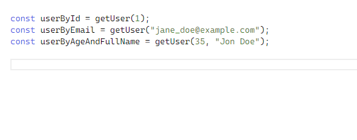
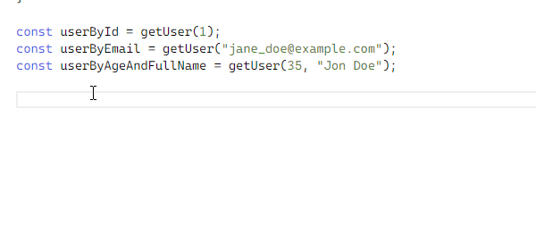

# Cómo Usar Funciones en TypeScript

:::info
La fuente original (en ingles) de este tutorial se encuentra [aquí](https://www.digitalocean.com/community/tutorials/how-to-use-functions-in-typescript)
:::

## Introducción
Crear y usar funciones es un aspecto fundamental de cualquier lenguaje de programación, y [TypeScript](https://www.typescriptlang.org/) no es diferente. TypeScript es totalmente compatible con la existente [sintaxis para funciones de JavaScript](https://www.digitalocean.com/community/tutorials/how-to-define-functions-in-javascript), al tiempo que agrega [información de tipo](./how-to-use-basic-types.html) y [sobrecarga de funciones](https://en.wikipedia.org/wiki/Function_overloading) como nuevas características. Además de proporcionar documentación adicional a la función, la información de tipo también reduce las posibilidades de errores en el código porque existe un menor riesgo de pasar tipos de datos no válidos a una función de tipo seguro.

En este tutorial, comenzará creando las funciones más básicas con información de tipo, luego pasará a escenarios más complejos, como el uso de [resto de parámetros](https://www.digitalocean.com/community/tutorials/understanding-destructuring-rest-parameters-and-spread-syntax-in-javascript) y la sobrecarga de funciones. Probarás diferentes ejemplos de código, que puedes seguir en tu propio entorno de TypeScript o en [TypeScript Playground](https://www.typescriptlang.org/play?ts=4.2.2#), un entorno en línea que te permite escribir TypeScript directamente en el navegador.

## Creación de Funciones Tipificadas

En esta sección, creará funciones en TypeScript y luego les agregará información de tipo.

En JavaScript, las funciones se pueden declarar de varias maneras. Una de las más populares es usar la palabra clave `function`, como se muestra a continuación:

```js
function sum(a, b) {
  return a + b;
}
```

En este ejemplo, `sum` es el nombre de la función, `(a, b)` son los argumentos y `{return a + b;}` es el cuerpo de la función.

La sintaxis para crear funciones en TypeScript es la misma, excepto por una adición importante: puede informar al compilador qué tipos debe tener cada argumento o parámetro. El siguiente bloque de código muestra la sintaxis general para esto, con las declaraciones de tipo resaltadas:

```ts{1}
function functionName(param1: Param1Type, param2: Param2Type): ReturnType {
  // ... body of the function
}
```

Con esta sintaxis, puede agregar tipos a los parámetros de la función `sum` que se mostró anteriormente. Esto asegura que `a` y `b` sean valores `number`. También puede agregar el tipo del valor devuelto:

```ts
function sum(a: number, b: number): number {
  return a + b;
}
```

Ahora TypeScript esperará que la función `sum` devuelva un valor numérico. Si llama a su función con algunos parámetros y almacena el valor del resultado en una variable llamada `result`:


```ts
const result = sum(1, 2);
```

La variable `result` tendrá el tipo `number`. Si está utilizando el playground de TypeScript o está utilizando un editor de texto que es totalmente compatible con TypeScript, al pasar el cursor sobre `result` se mostrará `const result: number`, lo que muestra que TypeScript ha implícito su tipo de la declaración de la función.

Si llamó a su función con un valor que tiene un tipo diferente al esperado por su función, el Compilador de TypeScript (`tsc`) le daría el error `2345`. Realice la siguiente llamada a la función `sum`:


```ts
sum('shark', 'whale');
```

Esto daría lo siguiente:


```sh
Output
Argument of type 'string' is not assignable to parameter of type 'number'. (2345)
```

Puede usar cualquier tipo en sus funciones, no solo [tipos básicos](./how-to-use-basic-types.html). Por ejemplo, imagine que tiene un tipo `User` que se ve así:

```ts
type User = {
  firstName: string;
  lastName: string;
};
```

Podría crear una función que devuelva el nombre completo del usuario como la siguiente:


```ts
function getUserFullName(user: User): string {
  return `${user.firstName} ${user.lastName}`;
}
```

La mayoría de las veces, TypeScript es lo suficientemente inteligente como para inferir el tipo de devolución de las funciones, por lo que puede eliminar el tipo de devolución de la declaración de la función en este caso:


```ts
function getUserFullName(user: User) {
  return `${user.firstName} ${user.lastName}`;
}
```

Observe que eliminó la parte de `: string`, que era el tipo de retorno de su función. Como está devolviendo una cadena en el cuerpo de su función, TypeScript asume correctamente que su función tiene un tipo de retorno de cadena.

Para llamar a su función ahora, debe pasar un objeto que tenga la misma forma que el tipo `User`:

```ts
type User = {
  firstName: string;
  lastName: string;
};

function getUserFullName(user: User) {
  return `${user.firstName} ${user.lastName}`;
}

const user: User = {
  firstName: "Jon",
  lastName: "Doe"
};

const userFullName = getUserFullName(user);
```

Este código pasará con éxito el verificador de tipos de TypeScript. Si pasa el cursor sobre la constante `userFullName` en su editor, el editor identificará su tipo como `string`.


## Parámetros de Funciones Opcionales en TypeScript

Tener todos los parámetros no siempre es necesario al crear funciones. En esta sección, aprenderá cómo marcar los parámetros de función como opcionales en TypeScript.

Para convertir un parámetro de función en uno opcional, agregue el modificador `?` justo después del nombre del parámetro. Dado un parámetro de función `param1` con tipo `T`, puede hacer que `param1` sea un parámetro opcional agregando `?`, como se destaca a continuación:


```ts
param1?: T
```

Por ejemplo, agregue un parámetro `prefix` opcional a su función `getUserFullName`, que es una cadena opcional que se puede agregar como prefijo al nombre completo del usuario:


```ts{6,7}
type User = {
  firstName: string;
  lastName: string;
};

function getUserFullName(user: User, prefix?: string) {
  return `${prefix ?? ''}${user.firstName} ${user.lastName}`;
}
```

En la primera parte resaltada de este bloque de código, está agregando un parámetro de prefijo opcional a su función, y en la segunda parte resaltada, está anteponiendo el nombre completo del usuario. Para hacer eso, está utilizando el [operador coalescente nulo `??`](https://developer.mozilla.org/en-US/docs/Web/JavaScript/Reference/Operators/Nullish_coalescing). De esta manera, solo usará el valor del prefijo si está definido; de lo contrario, la función utilizará una cadena vacía.

Ahora puede llamar a su función con o sin el parámetro de prefijo, como se muestra a continuación:


```ts
type User = {
  firstName: string;
  lastName: string;
};

function getUserFullName(user: User, prefix?: string) {
  return `${prefix ?? ''} ${user.firstName} ${user.lastName}`;
}

const user: User = {
  firstName: "Jon",
  lastName: "Doe"
};

const userFullName = getUserFullName(user);
const mrUserFullName = getUserFullName(user, 'Mr. ');
```

En este caso, el valor de `userFullName` será `Jon Doe` y el valor de `mrUserFullName` será `Mr. Jon Doe`.

Tenga en cuenta que no puede agregar un parámetro opcional antes de uno requerido; debe aparecer en último lugar en la serie, como se hace con `(user: User, prefix?: string)`. Enumerarlo primero haría que el compilador de TypeScript devolviera el error `1016`:


```sh
Output
A required parameter cannot follow an optional parameter. (1016)
```

## Expresiones de Funciones de Flecha Tipadas

Hasta ahora, este tutorial ha mostrado cómo escribir funciones normales en TypeScript, definidas con la palabra clave `function`. Pero en JavaScript, puede definir una función en más de una forma, como con [funciones de flecha](https://www.digitalocean.com/community/tutorials/understanding-arrow-functions-in-javascript). En esta sección, agregará tipos a las funciones de flecha en TypeScript.

La sintaxis para agregar tipos a las funciones de flecha es casi la misma que para agregar tipos a las funciones normales. Para ilustrar esto, cambie su función `getUserFullName` a una expresión de función de flecha:


```ts
const getUserFullName = (user: User, prefix?: string) =>
  `${prefix ?? ''}${user.firstName} ${user.lastName}`;
```


Si quisiera ser explícito sobre el tipo de retorno de su función, lo agregaría después de `()`, como se muestra en el código resaltado en el siguiente bloque:


```ts
const getUserFullName = (user: User, prefix?: string): string =>
  `${prefix ?? ''}${user.firstName} ${user.lastName}`;
```

Ahora puede usar su función exactamente como antes:


```ts
type User = {
  firstName: string;
  lastName: string;
};

const getUserFullName = (user: User, prefix?: string) =>
  `${prefix ?? ''}${user.firstName} ${user.lastName}`;

const user: User = {
  firstName: "Jon",
  lastName: "Doe"
};

const userFullName = getUserFullName(user);
```

Esto pasará el verificador de tipos de TypeScript sin ningún error.

:::tip Nota
Recuerda que todo lo que vale para funciones en JavaScript también vale para funciones en TypeScript. Para repasar estas reglas, consulte nuestro tutorial [Cómo Definir Funciones en JavaScript](https://www.digitalocean.com/community/tutorials/how-to-define-functions-in-javascript).
:::

## Tipos de Función

En las secciones anteriores, agregó tipos a los parámetros y valores devueltos para funciones en TypeScript. En esta sección, aprenderá a crear tipos de función, que son tipos que representan una firma de función específica. Crear un tipo que coincida con una función específica es especialmente útil cuando se pasan funciones a otras funciones, como tener un parámetro que es en sí mismo una función. Este es un patrón común cuando se crean funciones que aceptan [devoluciones de llamada](https://www.digitalocean.com/community/tutorials/understanding-the-event-loop-callbacks-promises-and-async-await-in-javascript).

La sintaxis para crear su tipo de función es similar a la creación de una función de flecha, con dos diferencias:

- Eliminas el cuerpo de la función.
- Haces que la declaración de la función devuelva el tipo `return` en sí.

Así es como crearía un tipo que coincida con la función `getUserFullName` que ha estado usando:


```ts{6}
type User = {
  firstName: string;
  lastName: string;
};

type PrintUserNameFunction = (user: User, prefix?: string) => string;
```

En este ejemplo, usó la palabra clave `type` para declarar un nuevo tipo, luego proporcionó el tipo para los dos parámetros entre paréntesis y el tipo para el valor devuelto después de la flecha.

Para un ejemplo más concreto, imagine que está creando una [funcion detectora de eventos](https://www.digitalocean.com/community/tutorials/understanding-events-in-javascript) llamada `onEvent`, que recibe como primer parámetro el nombre del evento y como segundo parámetro la devolución de llamada del evento. La devolución de llamada del evento en sí recibiría como primer parámetro un objeto con el siguiente tipo:


```ts
type EventContext = {
  value: string;
};
```

Luego puede escribir su función `onEvent` de esta manera:


```ts{7}
type EventContext = {
  value: string;
};

function onEvent(
  eventName: string,
  eventCallback: (target: EventContext) => void
) {
  // ... implementation
}
```

Tenga en cuenta que el tipo del parámetro `eventCallback` es un tipo de función:


```ts
eventCallback: (target: EventTarget) => void
```


Esto significa que su función `onEvent` espera que se pase otra función en el parámetro `eventCallback`. Esta función debería aceptar un solo argumento del tipo `EventTarget`. El tipo de retorno de esta función es ignorado por su función `onEvent`, por lo que está utilizando [`void`](./how-to-use-basic-types.html) como tipo.


## Uso de Funciones Asincrónicas Tipadas

Cuando se trabaja con JavaScript, es relativamente común tener [funciones asíncronas](https://www.digitalocean.com/community/tutorials/understanding-the-event-loop-callbacks-promises-and-async-await-in-javascript). TypeScript tiene una forma específica de lidiar con esto. En esta sección, creará funciones asincrónicas en TypeScript.

La sintaxis para crear funciones asincrónicas es la misma que la utilizada para JavaScript, con la adición de permitir tipos:


```ts
async function asyncFunction(param1: number) {
  // ... function implementation ...
}
```

Hay una gran diferencia entre agregar tipos a una función normal y agregar tipos a una función asíncrona: en una función asíncrona, el tipo de retorno siempre debe ser el genérico `Promise<T>`. El genérico `Promise<T>` representa el objeto `Promise` que devuelve una función asincrónica, donde `T` es el tipo de valor en el que se resuelve la promesa.

Imagina que tienes un tipo `User`:


```ts
type User = {
  id: number;
  firstName: string;
};
```

Imagine también que tiene algunos objetos de usuario en un almacén de datos. Estos datos podrían almacenarse en cualquier lugar, como en un archivo, una base de datos o detrás de una solicitud de API. Para simplificar, en este ejemplo usará una [matriz](https://www.digitalocean.com/community/tutorials/understanding-arrays-in-javascript):


```ts
type User = {
  id: number;
  firstName: string;
};

const users: User[] = [
  { id: 1, firstName: "Jane" },
  { id: 2, firstName: "Jon" }
];
```

Si desea crear una función de tipo seguro que recupere un usuario por ID de forma asíncrona, podría hacerlo así:


```ts
async function getUserById(userId: number): Promise<User | null> {
  const foundUser = users.find(user => user.id === userId);

  if (!foundUser) {
    return null;
  }

  return foundUser;
}
```


En esta función, primero está declarando su función como `async`. Luego estás especificando que acepta como primer parámetro el ID de usuario, que debe ser un `number`. El tipo de retorno de `getUserById` es una [Promise](https://www.digitalocean.com/community/tutorials/understanding-the-event-loop-callbacks-promises-and-async-await-in-javascript#promises) que se resuelve en `User` o `null`. Está utilizando el [tipo unión](./how-to-create-custom-types.html#uniones) `User | null` como parámetro de tipo para el genérico `Promise`.
 
`User | null` es la `T` en `Promise<T>`:


```ts
async function getUserById(userId: number): Promise<User | null> {
```

Llama a tu función usando `await` y almacena el resultado en una variable llamada `user`:


```ts
type User = {
  id: number;
  firstName: string;
};

const users: User[] = [
  { id: 1, firstName: "Jane" },
  { id: 2, firstName: "Jon" }
];

async function getUserById(userId: number): Promise<User | null> {
  const foundUser = users.find(user => user.id === userId);

  if (!foundUser) {
    return null;
  }

  return foundUser;
}

async function runProgram() {
  const user = await getUserById(1);
}
```

:::tip Nota
Está utilizando una función contenedora denominada `runProgram` porque no puede utilizar `await` en el nivel superior de un archivo. Si lo hace, el compilador de TypeScript emitirá el error `1375`:

```ts
Output
'await' expressions are only allowed at the top level of a file when that file is a module, but this file has no imports or exports. Consider adding an empty 'export {}' to make this file a module. (1375)
```
:::

Si pasa el cursor sobre `user` en su editor o en TypeScript Playground, encontrará que `user` tiene el tipo `User | null`, que es exactamente el tipo al que se resuelve la promesa devuelta por su función `getUserById`.

Si elimina el `await` y simplemente llama a la función directamente, se devuelve el objeto `Promise`:


```ts
async function runProgram() {
  const userPromise = getUserById(1);
}
```

Si pasa el cursor sobre `userPromise`, encontrará que tiene el tipo `Promise<User | null>`.

La mayoría de las veces, TypeScript puede inferir el tipo de retorno de su función asíncrona, tal como lo hace con las funciones no asíncronas. Por lo tanto, puede omitir el tipo de retorno de la función `getUserById`, ya que todavía se infiere correctamente que tiene el tipo `Promise<User | null>`:


```ts
async function getUserById(userId: number) {
  const foundUser = users.find(user => user.id === userId);

  if (!foundUser) {
    return null;
  }

  return foundUser;
}
```

## Agregar Tipos a Resto de Parámetros

Los [resto de parámetros](https://www.digitalocean.com/community/tutorials/understanding-destructuring-rest-parameters-and-spread-syntax-in-javascript#rest-parameters) son una característica de JavaScript que permite que una función reciba muchos parámetros como una sola matriz. En esta sección, utilizará resto de parámetros con TypeScript.

El uso de resto de parámetros de forma segura es completamente posible usando el resto de parámetros seguido del tipo de la matriz resultante. Tomemos como ejemplo el siguiente código, donde tiene una función llamada `sum` que acepta una cantidad variable de números y devuelve su suma total:


```ts{1}
function sum(...args: number[]) {
  return args.reduce((accumulator, currentValue) => {
    return accumulator + currentValue;
  }, 0);
}
```

Esta función usa el [método de Array `.reduce`](https://www.digitalocean.com/community/tutorials/how-to-use-array-methods-in-javascript-iteration-methods) para iterar sobre la matriz y agregar los elementos. Observe el resto de parametros `args` resaltados aquí. El tipo se establece en una matriz de números: `number[]`.

Llamar a su función trabaja normalmente:


```ts{7}
function sum(...args: number[]) {
  return args.reduce((accumulator, currentValue) => {
    return accumulator + currentValue;
  }, 0);
}

const sumResult = sum(2, 4, 6, 8);
```


Si llama a su función usando algo que no sea un número, como:


```ts
const sumResult = sum(2, "b", 6, 8);
```

El compilador de TypeScript emitirá el error `2345`:


```sh
Output
Argument of type 'string' is not assignable to parameter of type 'number'. (2345)
```

## Usar Sobrecargas de Funciones

Los programadores a veces necesitan una función para aceptar diferentes parámetros dependiendo de cómo se llame a la función. En JavaScript, esto normalmente se hace al tener un parámetro que puede asumir diferentes tipos de valores, como una cadena o un número. Establecer múltiples implementaciones con el mismo nombre de función se denomina _sobrecarga de funciones_.

Con TypeScript, puede crear sobrecargas de funciones que describan explícitamente los diferentes casos que abordan, lo que mejora la experiencia del desarrollador al documentar cada implementación de la función sobrecargada por separado. Esta sección explicará cómo usar la sobrecarga de funciones en TypeScript.

Imagina que tienes un tipo `User`:


```ts
type User = {
  id: number;
  email: string;
  fullName: string;
  age: number;
};
```

Y desea crear una función que pueda buscar un usuario usando cualquiera de la siguiente información:

- `id`
- `email`
- `age` y `fullName`


Podrías crear una función como esta:


```ts
function getUser(
  idOrEmailOrAge: number | string,
  fullName?: string
): User | undefined {
  // ... code
}
```

Esta función utiliza el operador `|` para componer una unión de tipos para `idOrEmailOrAge` y para el valor de retorno.

A continuación, agregue sobrecargas de función para cada forma en que desee que se use su función, como se muestra en el siguiente código resaltado:


```ts{8,9,10}
type User = {
  id: number;
  email: string;
  fullName: string;
  age: number;
};

function getUser(id: number): User | undefined;
function getUser(email: string): User | undefined;
function getUser(age: number, fullName: string): User | undefined;

function getUser(
  idOrEmailOrAge: number | string,
  fullName?: string
): User | undefined {
  // ... code
}
```

Esta función tiene tres sobrecargas, una para cada forma de recuperar un usuario. Al crear sobrecargas de funciones, agrega las sobrecargas de funciones antes de la implementación de la función en sí. Las sobrecargas de funciones no tienen cuerpo; solo tienen la lista de parámetros y el tipo de retorno.


A continuación, implementa la función en sí, que debe tener una lista de parámetros que sea compatible con todas las sobrecargas de funciones. En el ejemplo anterior, su primer parámetro puede ser un número o una cadena, ya que puede ser el `id`, el `email` o la `age`:


```ts
function getUser(id: number): User | undefined;
function getUser(email: string): User | undefined;
function getUser(age: number, fullName: string): User | undefined;

function getUser(
  idOrEmailOrAge: number | string,
  fullName?: string
): User | undefined {
  // ... code
}
```

Por lo tanto, establece el tipo del parámetro `idOrEmailorAge` en la implementación de su función para que sea `number | string`. De esta forma, es compatible con todas las sobrecargas de tu función `getUser`.

También está agregando un parámetro opcional a su función, para cuando el usuario pasa un `fullName`:

La implementación de su función podría ser como la siguiente, donde está utilizando una matriz `users` como el almacén de datos de sus usuarios:


```ts{15,19}
type User = {
  id: number;
  email: string;
  fullName: string;
  age: number;
};

const users: User[] = [
  { id: 1, email: "jane_doe@example.com", fullName: "Jane Doe" , age: 35 },
  { id: 2, email: "jon_do@example.com", fullName: "Jon Doe", age: 35 }
];

function getUser(id: number): User | undefined;
function getUser(email: string): User | undefined;
function getUser(age: number, fullName: string): User | undefined;

function getUser(
  idOrEmailOrAge: number | string,
  fullName?: string
): User | undefined {
  if (typeof idOrEmailOrAge === "string") {
    return users.find(user => user.email === idOrEmailOrAge);
  }

  if (typeof fullName === "string") {
    return users.find(user => user.age === idOrEmailOrAge && user.fullName === fullName);
  } else {
    return users.find(user => user.id === idOrEmailOrAge);
  }
}

const userById = getUser(1);
const userByEmail = getUser("jane_doe@example.com");
const userByAgeAndFullName = getUser(35, "Jon Doe");
```

En este código, si `idOrEmailOrAge` es una cadena, puede buscar al usuario con la clave `email`. El siguiente condicional asume que `idOrEmailOrAge` es un número, por lo que es el `id` o la `age`, dependiendo de si se define `fullName`.

Un aspecto interesante de las sobrecargas de funciones es que en la mayoría de los editores, incluidos VS Code y TypeScript Playground, tan pronto como escriba el nombre de la función y abra el primer paréntesis para llamar a la función, aparecerá una ventana emergente con todas las sobrecargas disponibles. como se muestra en la siguiente imagen:





Si agrega un comentario a cada sobrecarga funciones, el comentario también estará en la ventana emergente como fuente de documentación. Por ejemplo, agregue los siguientes comentarios resaltados a las sobrecargas de ejemplo:


```ts{2,3,4,6,7,8,10,11,12}
...
/**
 * Get a user by their ID.
 */
function getUser(id: number): User | undefined;
/**
 * Get a user by their email.
 */
function getUser(email: string): User | undefined;
/**
 * Get a user by their age and full name.
 */
function getUser(age: number, fullName: string): User | undefined;
...
```

Ahora, cuando pase el cursor sobre estas funciones, aparecerá el comentario para cada sobrecarga, como se muestra en la siguiente animación:





## Guardias de Tipo Definidas por el Usuario


La última característica de las funciones en TypeScript que examinará este tutorial son las guardias de tipo definidas por el usuario, que son funciones especiales que permiten a TypeScript inferir mejor el tipo de algún valor. Estas guardias imponen ciertos tipos en bloques de código condicional, donde el tipo de un valor puede ser diferente según la situación. Estos son especialmente útiles cuando se usa la función `Array.prototype.filter` para devolver una matriz de datos filtrada.

Una tarea común al agregar valores condicionalmente a una matriz es verificar algunas condiciones y luego solo agregar el valor si la condición es verdadera. Si el valor no es verdadero, el código agrega un [Booleano](https://www.digitalocean.com/community/tutorials/understanding-data-types-in-javascript) `false` a la matriz. Antes de usar esa matriz, puede filtrarla usando `.filter(Boolean)` para asegurarse de que solo se devuelvan valores verdaderos.

Cuando se llama con un valor, el constructor `Boolean` devuelve `true` o `false`, dependiendo de si este valor es `Truthy` o `Falsy`.

Por ejemplo, imagine que tiene una matriz de cadenas y solo desea incluir la cadena `production` en esa matriz si alguna otra bandera es verdadera:


```ts
const isProduction = false

const valuesArray = ['some-string', isProduction && 'production']

function processArray(array: string[]) {
  // do something with array
}

processArray(valuesArray.filter(Boolean))
```

Si bien esto es, en tiempo de ejecución, un código perfectamente válido, el Compilador de TypeScript le dará el error `2345` durante la compilación:


```sh
Output
Argument of type '(string | boolean)[]' is not assignable to parameter of type 'string[]'.
 Type 'string | boolean' is not assignable to type 'string'.
   Type 'boolean' is not assignable to type 'string'. (2345)
```

Este error dice que, en tiempo de compilación, el valor pasado a `processArray` se interpreta como una matriz de valores `false | string`, que no es lo que esperaba el `processArray`. Espera una matriz de cadenas: `string[]`.

Este es un caso en el que TypeScript no es lo suficientemente inteligente como para inferir que al usar `.filter(Boolean)` está eliminando todos los valores `falsy` de su matriz. Sin embargo, hay una forma de dar esta sugerencia a TypeScript: usando guardias de tipo definidos por el usuario.

Cree una función de guardia de tipos definida por el usuario llamada `isString`:


```ts{1}
function isString(value: any): value is string {
  return typeof value === "string"
}
```

Observe el tipo de retorno de la función `isString`. La forma de crear guardias de tipo definidas por el usuario es utilizando la siguiente sintaxis como el tipo de retorno de una función:


```ts
parameterName is Type
```

Donde `parameterName` es el nombre del parámetro que está probando y `Type` es el tipo esperado que tiene el valor de este parámetro si esta función devuelve `true`.

En este caso, está diciendo que `value` es un `string` si `isString` devuelve `true`. También está configurando el tipo de su parámetro `value` en `any`, por lo que funciona con cualquier tipo de valor.

Ahora, cambie su llamada `.filter` para usar su nueva función en lugar de pasarle el constructor `Boolean`:


```ts{13}
const isProduction = false

const valuesArray = ['some-string', isProduction && 'production']

function processArray(array: string[]) {
  // do something with array
}

function isString(value: any): value is string {
  return typeof value === "string"
}

processArray(valuesArray.filter(isString))
```

Ahora el compilador de TypeScript infiere correctamente que la matriz pasada a `processArray` solo contiene cadenas y su código se compila correctamente.

## Conclusión

Las funciones son el componente básico de las aplicaciones en TypeScript, y en este tutorial aprendió cómo crear funciones con seguridad de tipos en TypeScript y cómo aprovechar las sobrecargas de funciones para documentar mejor todas las variantes de una sola función. Tener este conocimiento permitirá funciones más seguras y fáciles de mantener en todo el código.


