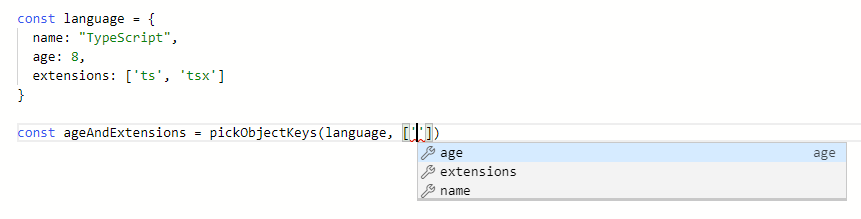

# Cómo Usar Genéricos en TypeScript

:::info
La fuente original (en ingles) de este tutorial se encuentra [aquí](https://www.digitalocean.com/community/tutorials/how-to-use-generics-in-typescript)
:::

## Introducción

Los genéricos son una característica fundamental de los lenguajes tipificados estáticamente, lo que permite a los desarrolladores pasar [tipos](./how-to-use-basic-types.html) como parámetros a otro tipo, [función](./how-to-use-functions.html) u otra estructura. Cuando un desarrollador convierte su componente en un componente genérico, le da a ese componente la capacidad de aceptar y aplicar la escritura que se pasa cuando se usa el componente, lo que mejora la flexibilidad del código, hace que los componentes sean reutilizables y elimina la duplicación.

[TypeScript](https://www.typescriptlang.org/) es totalmente compatible con los genéricos como una forma de introducir la seguridad de tipos en los componentes que aceptan argumentos y devuelven valores cuyo tipo será indeterminado hasta que se consuman más adelante en su código. En este tutorial, probará ejemplos del mundo real de genéricos de TypeScript y explorará cómo se usan en funciones, tipos, [clases](./how-to-use-classes.html) e [interfaces](how-to-use-interfaces.html). También usará genéricos para crear tipos mapeados y tipos condicionales, lo que lo ayudará a crear componentes de TypeScript que tengan la flexibilidad de aplicarse a todas las situaciones necesarias en su código.


## Sintaxis de Genéricos

Antes de entrar en la aplicación de los genéricos, este tutorial primero analizará la sintaxis de los genéricos de TypeScript, seguido de un ejemplo para ilustrar su propósito general.

Los genéricos aparecen en el código TypeScript entre corchetes angulares, en el formato `<T>,`, donde `T` representa un tipo pasado. `<T>` puede leerse como un genérico de tipo `T`. En este caso, `T` operará de la misma manera que los parámetros funcionan en las funciones, como marcadores de posición para un tipo que se declarará cuando se cree una instancia de la estructura. Por lo tanto, los tipos genéricos especificados entre paréntesis angulares también se conocen como _parámetros de tipo genérico_ o simplemente _parámetros de tipo_. También pueden aparecer varios tipos genéricos en una sola definición, como `<T, K, A>`.


:::tip Nota
Por convención, los programadores suelen utilizar una sola letra para nombrar un tipo genérico. Esta no es una regla de sintaxis, y puede nombrar genéricos como cualquier otro tipo en TypeScript, pero esta convención ayuda a transmitir inmediatamente a aquellos que leen su código que un tipo genérico no requiere un tipo específico.
:::

Los genéricos pueden aparecer en funciones, tipos, clases e interfaces. Cada una de estas estructuras se cubrirá más adelante en este tutorial, pero por ahora se usará una función como ejemplo para ilustrar la sintaxis básica de los genéricos.

Para ver cuán útiles son los genéricos, imagine que tiene una [función de JavaScript](https://www.digitalocean.com/community/tutorials/how-to-define-functions-in-javascript) que toma dos parámetros: un [objeto](https://www.digitalocean.com/community/tutorials/understanding-objects-in-javascript) y una [matriz](https://www.digitalocean.com/community/tutorials/understanding-arrays-in-javascript) de claves. La función devolverá un nuevo objeto basado en el original, pero solo con las claves que desea:


```ts
function pickObjectKeys(obj, keys) {
  let result = {}
  for (const key of keys) {
    if (key in obj) {
      result[key] = obj[key]
    }
  }
  return result
}
```

Este fragmento muestra la función `pickObjectKeys()`, que itera sobre la matriz `keys` y crea un nuevo objeto con las claves especificadas en la matriz.

Aquí hay un ejemplo que muestra cómo usar la función:


```ts
const language = {
  name: "TypeScript",
  age: 8,
  extensions: ['ts', 'tsx']
}

const ageAndExtensions = pickObjectKeys(language, ['age', 'extensions'])
```

Esto declara un `language` objeto, luego aísla la propiedad `age` y `extensions` con la función `pickObjectKeys()`. El valor de `ageAndExtensions` sería el siguiente:


```ts
{
  age: 8,
  extensions: ['ts', 'tsx']
}
```


Si tuviera que migrar este código a TypeScript para hacerlo seguro, tendría que usar genéricos. Puede refactorizar el código agregando las siguientes líneas resaltadas:


```ts{1,2}
function pickObjectKeys<T, K extends keyof T>(obj: T, keys: K[]) {
  let result = {} as Pick<T, K>
  for (const key of keys) {
    if (key in obj) {
      result[key] = obj[key]
    }
  }
  return result
}

const language = {
  name: "TypeScript",
  age: 8,
  extensions: ['ts', 'tsx']
}

const ageAndExtensions = pickObjectKeys(language, ['age', 'extensions'])
```

`<T, K extends keyof T>` declara dos tipos de parámetros para la función, donde a `K` se le asigna un tipo que es la unión de las claves en `T`. El parámetro de la función `obj` se establece luego en cualquier tipo que `T` represente, y `keys` en una matriz de cualquier tipo que `K` represente. Dado que `T` en el caso del objeto `language` establece `age` como un número y `extensions` como una matriz de cadenas, a la variable `ageAndExtensions` se le asignará ahora el tipo de un objeto con las propiedades `age: number` y `extensions: string[]`.

Esto impone un tipo de devolución basado en los argumentos proporcionados a `pickObjectKeys`, lo que permite a la función la flexibilidad de aplicar una estructura de escritura antes de que sepa el tipo específico que necesita aplicar. Esto también agrega una mejor experiencia de desarrollador cuando usa la función en un IDE como Visual Studio Code, que creará sugerencias para el parámetro `keys` según el objeto que proporcionó. Esto se muestra en la siguiente captura de pantalla:




Con una idea de cómo se crean los genéricos en TypeScript, ahora puede pasar a explorar el uso de genéricos en situaciones específicas. Este tutorial cubrirá primero cómo se pueden usar los genéricos en funciones.


## Usar Genéricos con Funciones

Uno de los escenarios más comunes para usar genéricos con funciones es cuando tiene algún código que no se escribe fácilmente para todos los casos de uso. Para que la función se aplique a más situaciones, puede incluir escritura genérica. En este paso, ejecutará un ejemplo de una función `identity` para ilustrar esto. También explorará un ejemplo asíncrono de cuándo pasar parámetros de tipo directamente a su genérico y cómo crear restricciones y valores predeterminados para sus parámetros de tipo genérico.

## Asignar Parámetros Genéricos

Eche un vistazo a la siguiente función, que devuelve lo que se pasó como primer argumento:


```ts
function identity(value) {
  return value;
}
```

Puede agregar el siguiente código para que la función sea segura en TypeScript:


```ts{1}
function identity<T>(value: T): T {
  return value;
}
```

Convirtió su función en una función genérica que acepta el parámetro de tipo genérico `T`, que es el tipo del primer argumento, luego estableció el tipo de retorno para que sea el mismo con: `T`.

A continuación, agregue el siguiente código para probar la función:


```ts{5}
function identity<T>(value: T): T {
  return value;
}

const result = identity(123);
```

`result` tiene el tipo `123`, que es el número exacto que pasó. TypeScript aquí está infiriendo el tipo genérico del propio código de llamada. De esta forma, el código de llamada no necesita pasar ningún parámetro de tipo. También puede ser explícito y establecer los parámetros de tipo genérico en el tipo que desee:


```ts{5}
function identity<T>(value: T): T {
  return value;
}

const result = identity<number>(123);
```

En este código, `result` tiene el tipo `number`. Al pasar el tipo con el código `<number>`, le está haciendo saber explícitamente a TypeScript que desea que el parámetro de tipo genérico `T` de la función `identity` sea del tipo `number`. Esto hará cumplir el tipo `number` como argumento y el valor de retorno.

## Pasar Parámetros de Tipo Directamente

Pasar parámetros de tipo directamente también es útil cuando se usan tipos personalizados. Por ejemplo, eche un vistazo al siguiente código:


```ts
type ProgrammingLanguage = {
  name: string;
};

function identity<T>(value: T): T {
  return value;
}

const result = identity<ProgrammingLanguage>({ name: "TypeScript" });
```


En este código, `result` tiene el tipo personalizado `ProgrammingLanguage` porque se pasa directamente a la función `identity`. Si no incluyera el parámetro de tipo explícitamente, `result` tendría el tipo `{ name: string }` en su lugar.


Otro ejemplo que es común cuando se trabaja con JavaScript es usar una función contenedora para recuperar datos de una API:


```ts
async function fetchApi(path: string) {
  const response = await fetch(`https://example.com/api${path}`)
  return response.json();
}
```

Esta [función asincrónica](https://www.digitalocean.com/community/tutorials/understanding-the-event-loop-callbacks-promises-and-async-await-in-javascript) toma una ruta de URL como argumento, utiliza la [API fetch](https://www.digitalocean.com/community/tutorials/how-to-use-the-javascript-fetch-api-to-get-data) para realizar una solicitud a la URL y luego devuelve un valor de respuesta [JSON](https://www.digitalocean.com/community/tutorials/how-to-work-with-json-in-javascript). En este caso, el tipo de devolución de la función `fetchApi` será `Promise<any>`, que es el tipo de devolución de la llamada `json()` en el objeto `response` de _fetch_.


Tener `any` como tipo de devolución no es muy útil. `any` significa cualquier valor de JavaScript y, al usarlo, pierde la verificación de tipo estática, uno de los principales beneficios de TypeScript. Si sabe que la API va a devolver un objeto en una forma determinada, puede hacer que esta función sea segura para tipos mediante el uso de genéricos:


```ts{1}
async function fetchApi<ResultType>(path: string): Promise<ResultType> {
  const response = await fetch(`https://example.com/api${path}`);
  return response.json();
}
```

El código resaltado convierte su función en una función genérica que acepta el parámetro de tipo genérico `ResultType`. Este tipo genérico se usa en el tipo de devolución de su función: `Promise<ResultType>`.


:::tip Nota
Como su función es `async`, debe devolver un objeto `Promise`. El tipo `Promise` de TypeScript es en sí mismo un tipo genérico que acepta el tipo del valor al que se resuelve la promesa.
:::

Si observa más de cerca su función, verá que el genérico no se usa en la lista de argumentos ni en ningún otro lugar donde TypeScript pueda inferir su valor. Esto significa que el código de llamada debe pasar explícitamente un tipo para este genérico al llamar a su función.

Aquí hay una posible implementación de la función genérica `fetchApi` para recuperar datos de usuario:


```ts{10}
type User = {
  name: string;
}

async function fetchApi<ResultType>(path: string): Promise<ResultType> {
  const response = await fetch(`https://example.com/api${path}`);
  return response.json();
}

const data = await fetchApi<User[]>('/users')

export {}
```

En este código, está creando un nuevo tipo llamado `User` y usando una matriz de ese tipo (`User[]`) como tipo para el parámetro genérico `ResultType`. La variable `data` ahora tiene el tipo `User[]` en lugar de `any`.


:::tip Nota 
Como está utilizando `await` para procesar de forma asíncrona el resultado de su función, el tipo de devolución será el tipo `T` en `Promise<T>`, que en este caso es el tipo genérico `ResultType`.
:::


## Parámetros de Tipo Predeterminados

Al crear su función `fetchApi` genérica como lo está haciendo, el código de llamada siempre tiene que proporcionar el parámetro de tipo. Si el código de llamada no incluye el tipo genérico, `ResultType` estaría vinculado a `unknown`. Tomemos por ejemplo la siguiente implementación:


```ts
async function fetchApi<ResultType>(path: string): Promise<ResultType> {
  const response = await fetch(`https://example.com/api${path}`);
  return 
response.json();
}

const data = await fetchApi('/users')

console.log(data.a)

export {}
```

Este código intenta acceder a una propiedad `a` teórica de `data`. Pero dado que el tipo de `data` es `unknown`, este código no podrá acceder a una propiedad del objeto.

Si no planea agregar un tipo específico a cada llamada de su función genérica, puede agregar un tipo predeterminado al parámetro de tipo genérico. Esto se puede hacer agregando `= DefaultType` justo después del tipo genérico, así:


```ts{1}
async function fetchApi<ResultType = Record<string, any>>(path: string): Promise<ResultType> {
  const response = await fetch(`https://example.com/api${path}`);
  return response.json();
}

const data = await fetchApi('/users')

console.log(data.a)

export {}
```

Con este código, ya no es necesario que pase un tipo al parámetro genérico `ResultType` al llamar a la función `fetchApi`, ya que tiene un tipo predeterminado de `Record<string, any>`. Esto significa que TypeScript reconocerá `data` como un objeto con claves de tipo `string` y valores de tipo `any`, lo que le permitirá acceder a sus propiedades.


## Restricciones de Parámetros de Tipo

En algunas situaciones, un parámetro de tipo genérico necesita permitir que solo ciertas formas pasen al genérico. Para crear esta capa adicional de especificidad para su genérico, puede imponer restricciones a su parámetro.

Imagine que tiene una restricción de almacenamiento en la que solo puede almacenar objetos que tienen valores de cadena para todas sus propiedades. Para eso, puedes crear una función que tome cualquier objeto y devuelva otro objeto con las mismas claves que el original, pero con todos sus valores transformados en cadenas. Esta función se llamará `stringifyObjectKeyValues`.

Esta función va a ser una función genérica. De esta manera, puede hacer que el objeto resultante tenga la misma forma que el objeto original. La función se verá así:


```ts
function stringifyObjectKeyValues<T extends Record<string, any>>(obj: T) {
  return Object.keys(obj).reduce((acc, key) =>  ({
    ...acc,
    [key]: JSON.stringify(obj[key])
  }), {} as { [K in keyof T]: string })
}
```


En este código, `stringifyObjectKeyValues` usa el [método `reduce` de matriz](https://www.digitalocean.com/community/tutorials/how-to-use-array-methods-in-javascript-iteration-methods) para iterar sobre una matriz de las claves originales, [encadenando](https://developer.mozilla.org/en-US/docs/Web/JavaScript/Reference/Global_Objects/JSON/stringify) los valores y agregándolos a una nueva matriz.

Para asegurarse de que el código de llamada siempre pase un objeto a su función, está utilizando una restricción de tipo en el tipo `T` genérico, como se muestra en el siguiente código resaltado:


```ts{1}
function stringifyObjectKeyValues<T extends Record<string, any>>(obj: T) {
  // ...
}
```

`extends Record<string, any>` se conoce como restricción de tipo genérico y le permite especificar que su tipo genérico debe ser asignable al tipo que viene después de la palabra clave `extends`. En este caso, `Record<string, any>` indica un objeto con claves de tipo `string` y valores de tipo `any`. Puede hacer que su parámetro de tipo amplíe cualquier tipo de TypeScript válido.

Al llamar a `reduce`, el tipo de retorno de la función reducer se basa en el valor inicial del acumulador. El código `{} as { [K in keyof T]: string }` establece el tipo del valor inicial del acumulador en `{ [K in keyof T]: string }` mediante el uso de una conversión de tipos en un objeto vacío, `{}`. El tipo `{ [K in keyof T]: string }` crea un nuevo tipo con las mismas claves que `T`, pero con todos los valores establecidos para tener el tipo `string`. Esto se conoce como un _tipo mapeado_, que este tutorial explorará más a fondo en una sección posterior.

El siguiente código muestra la implementación de su función `stringifyObjectKeyValues`:


```ts
function stringifyObjectKeyValues<T extends Record<string, any>>(obj: T) {
  return Object.keys(obj).reduce((acc, key) =>  ({
    ...acc,
    [key]: JSON.stringify(obj[key])
  }), {} as { [K in keyof T]: string })
}

const stringifiedValues = stringifyObjectKeyValues({ a: "1", b: 2, c: true, d: [1, 2, 3]})
```

La variable `stringifiedValues` tendrá el siguiente tipo:


```ts
{
  a: string;
  b: string;
  c: string;
  d: string;
}
```

Esto asegurará que el valor de retorno sea consistente con el propósito de la función.

Esta sección cubrió múltiples formas de usar genéricos con funciones, incluida la asignación directa de parámetros de tipo y la creación de valores predeterminados y restricciones a la forma del parámetro. A continuación, verá algunos ejemplos de cómo los genéricos pueden hacer que las interfaces y las clases se apliquen a más situaciones.

## Usar Genéricos con Interfaces, Clases y Tipos

Al crear [interfaces](./how-to-use-interfaces.html) y [clases](./how-to-use-classes.html) en TypeScript, puede resultar útil utilizar parámetros de tipo genérico para establecer la forma de los objetos resultantes. Por ejemplo, una clase podría tener propiedades de diferentes tipos según lo que se pase al constructor. En esta sección, verá la sintaxis para declarar parámetros de tipo genérico en clases e interfaces y examinará un caso de uso común en aplicaciones HTTP.

## Interfaces y Clases Genéricas

Para crear una interfaz genérica, puede agregar la lista de parámetros de tipo justo después del nombre de la interfaz:


```ts{1,2}
interface MyInterface<T> {
  field: T
}
```

Esto declara una interfaz que tiene una propiedad `field` cuyo tipo está determinado por el tipo pasado a `T`.


Para las clases, es casi la misma sintaxis:


```ts{1,2,3}
class MyClass<T> {
  field: T
  constructor(field: T) {
    this.field = field
  }
}
```

Un caso de uso común de interfaces/clases genéricas es cuando tiene un campo cuyo tipo depende de cómo el código del cliente usa la interfaz/clase. Digamos que tiene una clase `HttpApplication` que se usa para manejar solicitudes HTTP a su API, y que algún valor de contexto se pasará a cada controlador (_handler_) de solicitudes. Una de esas formas de hacer esto sería:


```ts
class HttpApplication<Context> {
  context: Context
  constructor(context: Context) {
    this.context = context;
  }

  // ... implementation

  get(url: string, handler: (context: Context) => Promise<void>): this {
    // ... implementation
    return this;
  }
}
```

Esta clase almacena un `context` cuyo tipo se pasa como el tipo del argumento para la función `handler` en el método `get`. Durante el uso, el tipo de parámetro que se pasa al controlador `get` se deducirá correctamente de lo que se pasa al constructor de la clase.


```ts
...
const context = { someValue: true };
const app = new HttpApplication(context);

app.get('/api', async () => {
  console.log(context.someValue)
});
```

En esta implementación, TypeScript inferirá el tipo de `context.someValue` como `boolean`.


## Tipos Genéricos

Habiendo visto algunos ejemplos de genéricos en clases e interfaces, ahora puede pasar a crear tipos personalizados genéricos. La sintaxis para aplicar genéricos a tipos es similar a cómo se aplican a interfaces y clases. Echa un vistazo al siguiente código:


```ts
type MyIdentityType<T> = T
```

Este tipo genérico devuelve el tipo que se pasa como parámetro de tipo. Imagina que implementaste este tipo con el siguiente código:


```ts
...
type B = MyIdentityType<number>
```

En este caso, el tipo `B` sería de tipo `number`.

Los tipos genéricos se usan comúnmente para crear tipos auxiliares, especialmente cuando se usan tipos mapeados. TypeScript proporciona muchos tipos de ayuda prediseñados. Un ejemplo de ello es el tipo `Partial`, que toma un tipo `T` y devuelve otro tipo con la misma forma que `T`, pero con todos sus campos configurados como opcionales. La implementación de `Partial` se ve así:


```ts
type Partial<T> = {
  [P in keyof T]?: T[P];
};
```

El tipo `Partial` aquí toma un tipo, itera sobre sus tipos de propiedad y luego los devuelve como opcionales en un nuevo tipo.


:::tip Nota
Dado que `Partial` ya está integrado en TypeScript, compilar este código en su entorno de TypeScript volvería a declarar `Partial` y generaría un error. La implementación de `Partial` citada aquí es solo para fines ilustrativos.
:::


Para ver cuán poderosos son los tipos genéricos, imagine que tiene un objeto literal que almacena los costos de envío de una tienda a todas las demás tiendas en su red de distribución comercial. Cada tienda estará identificada por un código de tres caracteres, así:


```ts
{
  ABC: {
    ABC: null,
    DEF: 12,
    GHI: 13,
  },
  DEF: {
    ABC: 12,
    DEF: null,
    GHI: 17,
  },
  GHI: {
    ABC: 13,
    DEF: 17,
    GHI: null,
  },
}
```


Este objeto es una colección de objetos que representan la ubicación de la tienda. Dentro de la ubicación de cada tienda, hay propiedades que representan el costo de envío a otras tiendas. Por ejemplo, el costo de envío de `ABC` a `DEF` es `12`. El costo de envío de una tienda a sí misma es `null`, ya que no habrá ningún envío.


Para asegurarse de que las ubicaciones de otras tiendas tengan un valor constante y que el envío de una tienda a sí misma sea siempre `null`, puede crear un tipo auxiliar genérico:


```ts
type IfSameKeyThanParentTOtherwiseOtherType<Keys extends string, T, OtherType> = {
  [K in Keys]: {
    [SameThanK in K]: T;
  } &
    { [OtherThanK in Exclude<Keys, K>]: OtherType };
};
```

El tipo `IfSameKeyThanParentTOtherwiseOtherType` recibe tres tipos genéricos. La primera, `Keys`, son todas las claves que desea asegurarse de que tiene su objeto. En este caso se trata de una unión de todos los códigos de las tiendas. `T` es el tipo para cuando el campo de objeto anidado tiene la misma clave que la clave en el objeto principal, que en este caso representa una ubicación de tienda que se envía a sí misma. Finalmente, `OtherType` es el tipo para cuando la clave es diferente, representando un envío de tienda a otra tienda.

Puedes usarlo así:


```ts
...
type Code = 'ABC' | 'DEF' | 'GHI'

const shippingCosts: IfSameKeyThanParentTOtherwiseOtherType<Code, null, number> = {
  ABC: {
    ABC: null,
    DEF: 12,
    GHI: 13,
  },
  DEF: {
    ABC: 12,
    DEF: null,
    GHI: 17,
  },
  GHI: {
    ABC: 13,
    DEF: 17,
    GHI: null,
  },
}
```

Este código ahora aplica la forma del tipo. Si establece alguna de las claves en un valor no válido, TypeScript nos dará un error:


```ts{4}
...
const shippingCosts: IfSameKeyThanParentTOtherwiseOtherType<Code, null, number> = {
  ABC: {
    ABC: 12,
    DEF: 12,
    GHI: 13,
  },
  DEF: {
    ABC: 12,
    DEF: null,
    GHI: 17,
  },
  GHI: {
    ABC: 13,
    DEF: 17,
    GHI: null,
  },
}
```


Dado que el costo de envío entre `ABC` y él mismo ya no es `null`, TypeScript arrojará el siguiente error:


```sh
Output
Type 'number' is not assignable to type 'null'.(2322)
```

Ya ha probado el uso de genéricos en interfaces, clases y tipos _helper_ personalizados. A continuación, explorará más a fondo un tema que ya ha surgido varias veces en este tutorial: crear tipos mapeados con genéricos.


## Crear Tipos Mapeados con Genéricos

Al trabajar con TypeScript, hay momentos en los que necesitará crear un tipo que debería tener la misma forma que otro tipo. Esto significa que debe tener las mismas propiedades, pero con el tipo de propiedades establecido en algo diferente. Para esta situación, el uso de tipos mapeados puede reutilizar la forma de tipo inicial y reducir el código repetido en su aplicación.

En TypeScript, esta estructura se conoce como tipo mapeado y se basa en genéricos. En esta sección, verá cómo crear un tipo mapeado.

Imagine que desea crear un tipo que, dado otro tipo, devuelva un nuevo tipo donde todas las propiedades están configuradas para tener un valor `boolean`. Podrías crear este tipo con el siguiente código:


```ts
type BooleanFields<T> = {
  [K in keyof T]: boolean;
}
```

En este tipo, está utilizando la sintaxis `[K in keyof T]` para especificar las propiedades que tendrá el nuevo tipo. El operador `keyof T` se usa para devolver una unión con el nombre de todas las propiedades disponibles en `T`. Luego está usando la la sintaxis `K in` para designar que las propiedades del nuevo tipo son todas las propiedades actualmente disponibles en el tipo de unión devuelto por `keyof T`.

Esto crea un nuevo tipo llamado `K`, que está vinculado al nombre de la propiedad actual. Esto se puede usar para acceder al tipo de esta propiedad en el tipo original usando la sintaxis `T[K]`. En este caso, está configurando el tipo de las propiedades para que sean `boolean`.

Un escenario de uso para este tipo `BooleanFields` es crear un objeto de opciones. Imagine que tiene un modelo de base de datos, como un `User`. Al obtener un registro para este modelo de la base de datos, también permitirá pasar un objeto que especifique qué campos devolver. Este objeto tendría las mismas propiedades que el modelo, pero con el tipo establecido en booleano. Pasar `true` en un campo significa que desea que se devuelva y `false` que desea que se omita.

Podría usar su `BooleanFields` genérico en el tipo de modelo existente para devolver un nuevo tipo con la misma forma que el modelo, pero con todos los campos configurados para tener un tipo `boolean`, como en el siguiente código resaltado:


```ts{10}
type BooleanFields<T> = {
  [K in keyof T]: boolean;
};

type User = {
  email: string;
  name: string;
}

type UserFetchOptions = BooleanFields<User>;
```

En este ejemplo, `UserFetchOptions` sería lo mismo que crearlo así:


```ts
type UserFetchOptions = {
  email: boolean;
  name: boolean;
}
```

Al crear tipos mapeados, también puede proporcionar modificadores para los campos. Un ejemplo de ello es el tipo genérico existente disponible en TypeScript denominado `Readonly<T>`. El tipo `Readonly<T>` devuelve un nuevo tipo en el que todas las propiedades del tipo pasado se establecen como propiedades `readonly`. La implementación de este tipo se ve así:


```ts
type Readonly<T> = {
  readonly [K in keyof T]: T[K]
}
```

:::tip Nota
Dado que `Readonly` ya está integrado en TypeScript, compilar este código en su entorno de TypeScript volvería a declarar `Readonly` y generaría un error. La implementación de `Readonly` citada aquí es solo para fines ilustrativos.
:::

Observe el modificador readonly que se agrega como prefijo a la parte [K in keyof T] en este código. Actualmente, los dos modificadores disponibles que se pueden usar en tipos mapeados son el modificador de solo lectura, que debe agregarse como prefijo a la propiedad, y el ? modificador, que se puede agregar como sufijo a la propiedad. El ? El modificador marca el campo como opcional. Ambos modificadores pueden recibir un prefijo especial para especificar si el modificador debe eliminarse (-) o agregarse (+). Si solo se proporciona el modificador, se asume +.

Ahora que puede usar tipos mapeados para crear nuevos tipos basados en formas de tipos que ya ha creado, puede pasar al caso de uso final para genéricos: tipificación condicional.

## Crear Tipos Condicionales con Genéricos

En esta sección, probará otra característica útil de los genéricos en TypeScript: crear tipos condicionales. En primer lugar, recorrerá la estructura básica de tipificación condicional. Luego explorará un caso de uso avanzado mediante la creación de un tipo condicional que omite los campos anidados de un tipo de objeto basado en la notación de puntos.

## Estructura Básica de Tipificación Condicional

Los tipos condicionales son tipos genéricos que tienen un tipo resultante diferente dependiendo de alguna [condición](https://www.digitalocean.com/community/tutorials/how-to-write-conditional-statements-in-javascript). Por ejemplo, observe el siguiente tipo genérico `IsStringType<T>`:


```ts
type IsStringType<T> = T extends string ? true : false;
```

En este código, está creando un nuevo tipo genérico llamado `IsStringType` que recibe un solo parámetro de tipo, `T`. Dentro de la definición de su tipo, está usando una sintaxis que parece una expresión condicional usando el operador ternario en JavaScript: `T extends string ? true : false`. Esta expresión condicional verifica si el tipo `T` extiende el tipo `string`. Si es así, el tipo resultante será exactamente el tipo `true`; de lo contrario, se establecerá en el tipo `false`.


:::tip Nota
Esta expresión condicional se evalúa durante la compilación. TypeScript solo funciona con tipos, así que asegúrese de leer siempre los identificadores dentro de una declaración de tipo como tipos, no como valores. En este código, está utilizando el tipo exacto de cada valor booleano, `true` y `false`.
:::

Para probar este tipo condicional, pase algunos tipos como su parámetro de tipo:


```ts
type IsStringType<T> = T extends string ? true : false;

type A = "abc";
type B = {
  name: string;
};

type ResultA = IsStringType<A>;
type ResultB = IsStringType<B>;
```

En este código, está creando dos tipos, `A` y `B`. El tipo `A` es el tipo del literal de cadena `"abc"`, mientras que el tipo `B` es el tipo de un objeto que tiene una propiedad llamada `name` de tipo `string`. A continuación, utiliza ambos tipos con su tipo condicional `IsStringType` y almacena el tipo resultante en dos nuevos tipos, `ResultA` y `ResultB`.

Si verifica el tipo resultante de  `ResultA` y `ResultB`, notará que el tipo `ResultA` se establece en el tipo exacto `true` y que el tipo `ResultB` se establece en `false`. Esto es correcto, ya que `A` extiende el tipo `string` y `B` no extiende el tipo `string`, ya que se establece en el tipo de un objeto con una sola propiedad `name` de tipo `string`.

Una característica útil de los tipos condicionales es que le permite inferir información de tipo dentro de la cláusula `extends` usando la palabra clave especial `infer`. Este nuevo tipo se puede usar en la rama `true` de la condición. Un posible uso de esta función es recuperar el tipo de retorno de cualquier tipo de función.

Escriba el siguiente tipo `GetReturnType` para ilustrar esto:


```ts
type GetReturnType<T> = T extends (...args: any[]) => infer U ? U : never;
```

En este código, está creando un nuevo tipo genérico, que es un tipo condicional llamado `GetReturnType`. Este tipo genérico acepta un solo parámetro de tipo, `T`. Dentro de la declaración de tipo en sí, está verificando si el tipo `T` extiende un tipo que coincide con una firma de función que acepta un número variable de argumentos (incluido cero), y luego está infiriendo el tipo de retorno de esa función creando un nuevo tipo `U`, que está disponible para ser utilizado dentro de la rama `true` de la condición. El tipo de `U` estará ligado al tipo del valor de retorno de la función pasada. Si el tipo `T` pasado no es una función, entonces el código devolverá el tipo `never`.

Usa tu tipo con el siguiente código:


```ts
type GetReturnType<T> = T extends (...args: any[]) => infer U ? U : never;

function someFunction() {
  return true;
}

type ReturnTypeOfSomeFunction = GetReturnType<typeof someFunction>;
```

En este código, está creando una función llamada `someFunction`, que devuelve `true`. A continuación, utiliza el operador `typeof` para pasar el tipo de esta función al tipo genérico `GetReturnType` y almacena el tipo resultante en el tipo `ReturnTypeOfSomeFunction`.

Como el tipo de su variable `someFunction` es una función, el tipo condicional evaluaría la rama `true` de la condición. Esto devolverá el tipo `U` como resultado. El tipo `U` se dedujo del tipo de retorno de la función, que en este caso es un `boolean`. Si verifica el tipo de `ReturnTypeOfSomeFunction`, encontrará que está configurado correctamente para tener el tipo `boolean`.

## Caso de Uso de Tipo Condicional Avanzado

Los tipos condicionales son una de las características más flexibles disponibles en TypeScript y permiten la creación de algunos tipos de utilidades avanzadas. En esta sección, explorará uno de estos casos de uso mediante la creación de un tipo condicional llamado `NestedOmit<T, KeysToOmit>`. Este tipo de utilidad podrá omitir campos de un objeto, al igual que el existente [tipo de utilidad `Omit<T, KeysToOmit>`](https://www.typescriptlang.org/docs/handbook/utility-types.html#omittype-keys), pero también permitirá omitir campos anidados mediante la notación de puntos.

Usando su nuevo genérico `NestedOmit<T, KeysToOmit>`, podrá usar el tipo como se muestra en el siguiente ejemplo:

```ts
type SomeType = {
  a: {
    b: string,
    c: {
      d: number;
      e: string[]
    },
    f: number
  }
  g: number | string,
  h: {
    i: string,
    j: number,
  },
  k: {
    l: number,<F3>
  }
}

type Result = NestedOmit<SomeType, "a.b" | "a.c.e" | "h.i" | "k">;
```

Este código declara un tipo denominado `SomeType` que tiene una estructura de varios niveles de propiedades anidadas. Usando su genérico `NestedOmit`, pasa el tipo, luego enumera las claves de las propiedades que le gustaría omitir. Observe cómo puede usar la notación de puntos en el segundo parámetro de tipo para identificar las claves a omitir. El tipo resultante se almacena en `Result`.

La construcción de este tipo condicional utilizará muchas funciones disponibles en TypeScript, como tipos de plantilla literal, genéricos, tipos condicionales y tipos mapeados.

Para probar este genérico, comience creando un tipo genérico llamado `NestedOmit` que acepte dos parámetros de tipo:


```ts
type NestedOmit<T extends Record<string, any>, KeysToOmit extends string>
```

El primer parámetro de tipo se llama `T`, que debe ser un tipo que se pueda asignar al tipo `Record<string, any>`. Este será el tipo de objeto del que desea omitir propiedades. El segundo parámetro de tipo se llama `KeysToOmit`, que debe ser de tipo `string`. Lo utilizará para especificar las claves que desea omitir de su tipo `T`.

A continuación, verifique si `KeysToOmit` se puede asignar al tipo `${infer KeyPart1}.${infer KeyPart2}` agregando el siguiente código resaltado:


```ts{2}
type NestedOmit<T extends Record<string, any>, KeysToOmit extends string>
  = KeysToOmit extends `${infer KeyPart1}.${infer KeyPart2}`
```

Aquí, está utilizando un tipo de cadena de literal de plantilla mientras aprovecha los tipos condicionales para inferir otros dos tipos dentro del propio literal de plantilla. Al deducir dos partes del tipo de cadena literal de plantilla, está dividiendo la cadena en otras dos cadenas. La primera parte se asignará al tipo `KeyPart1` y contendrá todo antes del primer punto. La segunda parte se asignará al tipo `KeyPart2` y contendrá todo después del primer punto. Si pasó `"a.b.c"` como `KeysToOmit`, inicialmente `KeyPart1` se establecería en el exacto tipo de cadena `"a"`, y `KeyPart2` se establecería en `"b.c"`.

A continuación, agregará el operador ternario para definir la primera rama `true` de la condición:


```ts{3,4}
type NestedOmit<T extends Record<string, any>, KeysToOmit extends string>
  = KeysToOmit extends `${infer KeyPart1}.${infer KeyPart2}`
    ?
      KeyPart1 extends keyof T
```

Esto usa `KeyPart1 extends keyof T` para verificar si `KeyPart1` es una propiedad válida del tipo `T` dado. En caso de que tenga una clave válida, agregue el siguiente código para que la condición se evalúe como una intersección entre los dos tipos:


```ts{5,6,7,8,9}
type NestedOmit<T extends Record<string, any>, KeysToOmit extends string>
  = KeysToOmit extends `${infer KeyPart1}.${infer KeyPart2}`
    ?
      KeyPart1 extends keyof T
      ?
        Omit<T, KeyPart1>
        & {
          [NewKeys in KeyPart1]: NestedOmit<T[NewKeys], KeyPart2>
        }
```

`Omit<T, KeyPart1>` es un tipo creado con el _helper_ `Omit` que se incluye de forma predeterminada con TypeScript. En este punto, `KeyPart1` no está en notación de puntos: contendrá el nombre exacto de un campo que contiene campos anidados que desea omitir del tipo original. Debido a esto, puede usar con seguridad el tipo de utilidad existente.

Está utilizando `Omit` para eliminar algunos campos anidados que están dentro de `T[KeyPart1]` y, para hacerlo, debe reconstruir el tipo de `T[KeyPart1]`. Para evitar reconstruir todo el tipo `T`, use `Omit` para eliminar solo `KeyPart1` de `T`, conservando otros campos. Entonces está reconstruyendo `T[KeyPart1]` en el tipo de la siguiente parte.

`[NewKeys in KeyPart1]: NestedOmit<T[NewKeys], KeyPart2>` es un tipo mapeado donde las propiedades son las que se pueden asignar a `KeyPart1`, lo que significa la parte que acaba de extraer de `KeysToOmit`. Este es el padre de los campos que desea eliminar. Si pasó `a.b.c`, durante la primera evaluación de su condición sería `NewKeys in "a"`. Luego está configurando el tipo de esta propiedad para que sea el resultado de llamar recursivamente a su tipo de utilidad `NestedOmit`, pero ahora pasa como el primer parámetro de tipo el tipo de esta propiedad dentro de `T` usando `T[NewKeys]`, y pasa como segundo parámetro de tipo el resto de claves en notación de punto, disponibles en `KeyPart2`.

En la rama `false` de la condición interna, devuelve el tipo actual vinculado a `T`, como si `KeyPart1` no fuera una clave válida de `T`:


```ts{10}
type NestedOmit<T extends Record<string, any>, KeysToOmit extends string>
  = KeysToOmit extends `${infer KeyPart1}.${infer KeyPart2}`
    ?
      KeyPart1 extends keyof T
      ?
        Omit<T, KeyPart1>
        & {
          [NewKeys in KeyPart1]: NestedOmit<T[NewKeys], KeyPart2>
        }
      : T
```

Esta rama del condicional significa que estás tratando de omitir un campo que no existe en `T`. En este caso, no hay necesidad de ir más lejos.

Finalmente, en la rama `false` de la condición externa, use el tipo de utilidad `Omit` existente para omitir `KeysToOmit` de `Type`:


```ts{11}
type NestedOmit<T extends Record<string, any>, KeysToOmit extends string>
  = KeysToOmit extends `${infer KeyPart1}.${infer KeyPart2}`
    ?
      KeyPart1 extends keyof T
      ?
        Omit<T, KeyPart1>
        & {
          [NewKeys in KeyPart1]: NestedOmit<T[NewKeys], KeyPart2>
        }
      : T
    : Omit<T, KeysToOmit>;
```

Si es `false` la siguiente condición . . .
```ts
KeysToOmit extends `${infer KeyPart1}.${infer KeyPart2}`
```
. . . significa que `KeysToOmit` no usa la notación de puntos y, por lo tanto, puede usar el tipo de utilidad `Omit` existente.


Ahora, para usar su nuevo tipo condicional `NestedOmit`, cree un nuevo tipo llamado `NestedObject`:


```ts
type NestedObject = {
  a: {
    b: {
      c: number;
      d: number;
    };
    e: number;
  };
  f: number;
};
```


Luego llame a `NestedOmit` para omitir el campo anidado disponible en `a.b.c`:


```ts
type Result = NestedOmit<NestedObject, "a.b.c">;
```

En la primera evaluación del tipo condicional, la condición externa sería `true`, ya que el tipo de literal de cadena `"a.b.c"` se puede asignar al tipo de literal de plantilla `${infer KeyPart1}.${infer KeyPart2}`. En este caso, `KeyPart1` se deduciría como el tipo de cadena literal `"a"` y `KeyPart2` se deduciría como el resto de la cadena, en este caso `"b.c"`.

La condición interna ahora va a ser evaluada. Esto se evaluará como `true`, ya que `KeyPart1` en este punto es una clave de `T`. `KeyPart1` ahora es `"a"`, y `T` tiene una propiedad `"a"`:


```ts{2,3,4,5,6,7,8}
type NestedObject = {
  a: {
    b: {
      c: number;
      d: number;
    };
    e: number;
  };
  f: number;
};
```


Avanzando con la evaluación de la condición, ahora se encuentra dentro de la rama `true` interna. Esto crea un nuevo tipo que es una intersección de otros dos tipos. El primer tipo es el resultado de usar el tipo de utilidad `Omit` en `T` para omitir los campos que se pueden asignar a `KeyPart1`, en este caso el campo `a`. El segundo tipo es un nuevo tipo que está creando llamando a `NestedOmit` de forma recursiva.

Si pasa por la próxima evaluación de `NestedOmit`, para la primera llamada recursiva, el tipo de intersección ahora está creando un tipo para usar como el tipo del campo `a`. Esto recrea el campo `a` sin los campos anidados que debe omitir.

En la evaluación final de `NestedOmit`, la primera condición devolvería `false`, ya que el tipo de cadena que se pasa ahora es solo `"c"`. Cuando esto sucede, omite el campo del objeto con el _helper_ integrado. Esto devolvería el tipo para el campo `b`, que es el tipo original con `c` omitido. La evaluación ahora finaliza y TypeScript devuelve el nuevo tipo que desea usar, con el campo anidado omitido.


## Conclusión

En este tutorial, exploró los genéricos según se aplican a funciones, interfaces, clases y tipos personalizados. También usó genéricos para crear tipos mapeados y condicionales. Cada uno de estos hace que los genéricos sean una herramienta poderosa que tiene a su disposición cuando usa TypeScript. Usarlos correctamente evitará que tengas que repetir el código una y otra vez y hará que los tipos que hayas escrito sean más flexibles. Esto es especialmente cierto si es autor de una biblioteca y planea hacer que su código sea legible para una amplia audiencia.
